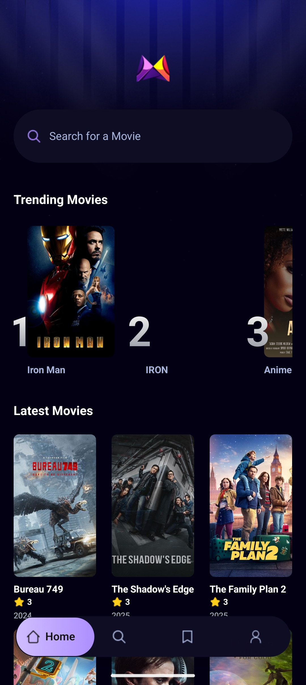
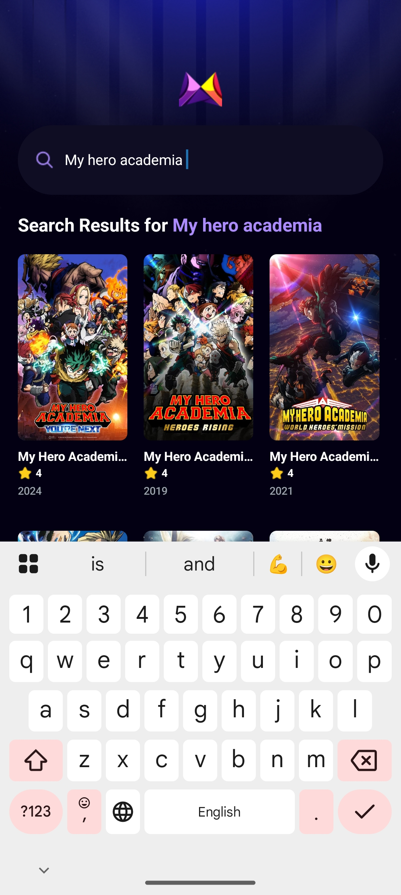
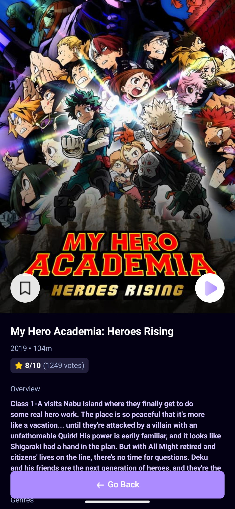
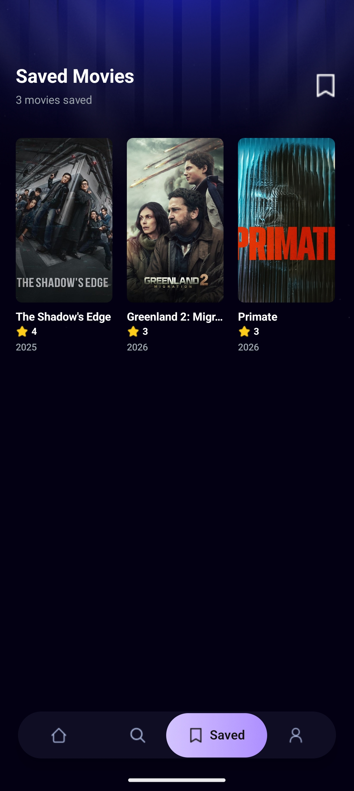
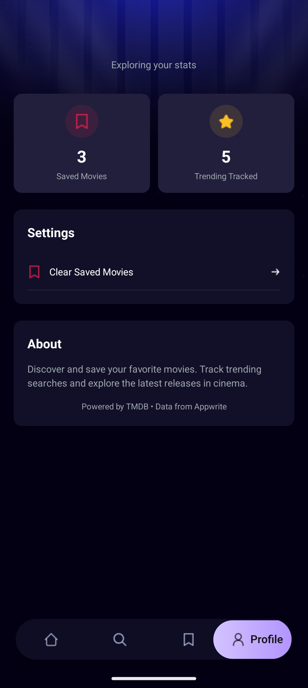

# 🎬 Movie Discovery App

A modern, feature-rich movie discovery application built with React Native and Expo, featuring trending movies, search functionality, and detailed movie information powered by The Movie Database (TMDB) API and Appwrite.

## ✨ Features

- 🔍 **Smart Search** - Search for movies with debounced input and real-time results
- 🔥 **Trending Movies** - View the most searched movies based on user activity
- 📱 **Responsive Design** - Beautiful UI with custom tab navigation and smooth animations
- 🎥 **Movie Details** - Comprehensive movie information including ratings, genres, runtime, and overview
- 💾 **Save Movies** - Bookmark your favorite movies with persistent local storage
- 📊 **Profile & Statistics** - Track your saved movies, trending searches, and activity
- 💾 **Search Analytics** - Track popular searches using Appwrite backend
- ⚡ **Fast Performance** - Optimized with custom hooks and efficient data fetching

## 📷 Screenshots

<table>
  <tr>
    <td></td>
    <td></td>
    <td></td>
  </tr>
  <tr>
    <td></td>
    <td></td>

  </tr>
  
</table>

## 🛠️ Tech Stack

- **Framework:** React Native with Expo
- **Language:** TypeScript
- **Navigation:** Expo Router with file-based routing
- **Styling:** NativeWind - Tailwind CSS for React Native
- **Storage:** AsyncStorage for local data persistence
- **Backend:** Appwrite for search analytics and trending data
- **API:** The Movie Database (TMDB) API for movie data

## 🚀 Getting Started

### 1. Clone the repository

```bash
git clone <repo-url>
cd Movie Discovery App
```

### 2. Install dependencies

```bash
npm install
```

### 3. Set up environment variables

Create a `.env` file in the root directory and add your API keys:

```env
# TMDB API Configuration
EXPO_PUBLIC_TMDB_API_READ_ACCESS_TOKEN=your_tmdb_api_token_here

# Appwrite Configuration
EXPO_PUBLIC_APPWRITE_ENDPOINT=your_appwrite_endpoint
EXPO_PUBLIC_APPWRITE_PROJECT_ID=your_appwrite_project_id
EXPO_PUBLIC_APPWRITE_DATABASE_ID=your_database_id
EXPO_PUBLIC_APPWRITE_COLLECTION_ID=your_collection_id
```

#### Getting API Keys:

**TMDB API:**

1. Visit [The Movie Database](https://www.themoviedb.org/)
2. Create an account and go to Settings > API
3. Request an API key and copy the "Read Access Token"

**Appwrite:**

1. Visit [Appwrite Cloud](https://cloud.appwrite.io/)
2. Create a new project
3. Create a database and collection with the following attributes:
   - `searchTerm` (string)
   - `movie_id` (integer)
   - `title` (string)
   - `count` (integer)
   - `poster_url` (string)
4. Copy your project ID, database ID, and collection ID

### 4. Start the development server

```bash
npm start
```

This will start the Expo development server. You can then:

- Press `a` - Open on Android emulator
- Press `i` - Open on iOS simulator
- Press `w` - Open in web browser
- Scan QR code with Expo Go app on your physical device

## 📱 Available Scripts

```bash
npm start          # Start the development server
npm run android    # Run on Android device/emulator
npm run ios        # Run on iOS simulator
npm run web        # Run in web browser
npm run lint       # Run ESLint for code quality
```

## 🏗️ Project Structure

```
Movie-App/
├── app/
│   ├── (tabs)/
│   │   ├── _layout.tsx
│   │   ├── index.tsx
│   │   ├── profile.tsx
│   │   ├── saved.tsx
│   │   └── search.tsx
│   ├── movies/
│   │   └── [id].tsx
│   ├── _layout.tsx
│   └── global.css
├── assets/
│   ├── fonts/
│   │   └── SpaceMono-Regular.ttf
│   ├── icons/
│   │   ├── arrow.png
│   │   ├── home.png
│   │   ├── logo.png
│   │   ├── person.png
│   │   ├── play.png
│   │   ├── save.png
│   │   ├── search.png
│   │   └── star.png
│   ├── images/
│   │   ├── bg.png
│   │   ├── highlight.png
│   │   ├── logo.png
│   │   └── rankingGradient.png
│   └── readme-assets/
├── components/
│   ├── MovieCard.tsx
│   ├── SearchBar.tsx
│   └── TrendingCard.tsx
├── constants/
│   ├── icons.ts
│   └── images.ts
├── interfaces/
│   └── interfaces.d.ts
├── services/
│   ├── api.ts
│   ├── appwrite.ts
│   ├── storage.ts
│   └── usefetch.ts
├── types/
│   └── images.d.ts
├── .env
├── .gitignore
├── app.json
├── babel.config.js
├── eslint.config.js
├── expo-env.d.ts
├── metro.config.js
├── nativewind-env.d.ts
├── package.json
├── README.md
├── tailwind.config.js
└── tsconfig.json
```

## 🎯 Key Features Explained

### Custom Hook: `useFetch`

A reusable hook that handles API requests with loading states, error handling, and manual refetch capability:

```typescript
const { data, loading, error, refetch, reset } = useFetch(fetchFunction);
```

Save Movies Feature
Movies can be saved/bookmarked from the movie details screen:

- **Persistent Storage**: Uses AsyncStorage for local data persistence
- **Optimistic Updates**: Immediate UI feedback with error recovery
- **Saved Screen**: View all saved movies in a grid layout
- **Easy Removal**: Tap any saved movie to view details and unsave

### Profile & Statistics

Track your movie browsing activity:

- **Saved Movies Count**: See how many movies you've bookmarked
- **Trending Analytics**: View trending movies being searched by users
- **Search Activity**: Track total searches across the platform
- **Clear Data**: Option to clear all saved movies with confirmation

###

### Debounced Search

Search functionality implements a 500ms debounce to optimize API calls and reduce unnecessary requests.

### Trending Algorithm

Movies are ranked based on search frequency, stored in Appwrite database with automatic count incrementation.

### File-based Routing

Using Expo Router for intuitive navigation:

- `(tabs)` - Group route for tab navigation
- `[id]` - Dynamic route for movie details

## 🎨 Customization

User authentication and profiles

- [ ] Movie recommendations based on saved movies
- [ ] Video trailer playback integration
- [ ] Social sharing features
- [ ] Advanced filtering and sorting options
- [ ] Dark/Light theme toggle

## 🐛 Known Issues

- Video playback not yet implemented
- Rate This App button is a placeholder

```

## 🔜 Upcoming Features

- [ ] User authentication
- [ ] Video trailer playback
- [ ] Social sharing features

## 👨‍💻 Author

**Irfan Mehmud**
- GitHub: [@Irfan140](https://github.com/Irfan140)


## 📞 Support

If you have any questions or need help, please open an issue in the GitHub repository.

---

Made with ❤️ using React Native and Expo
```
